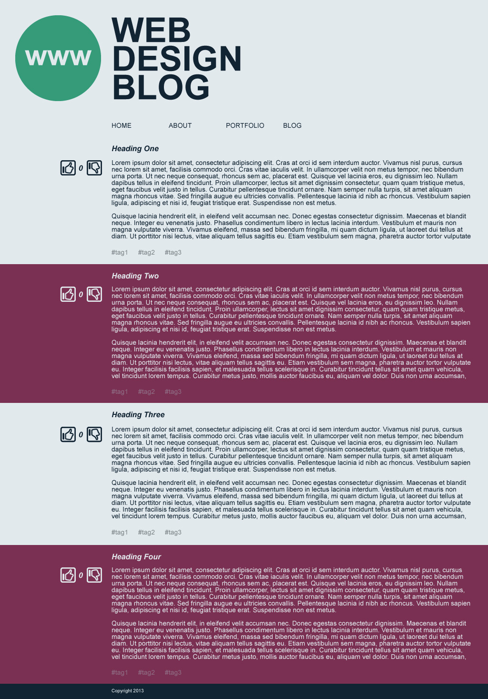
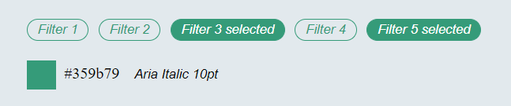

# Posts
The application uses fake backed, ensure `HttpClient` from `@angular/common/http` is used to create http requests

## 1. Create posts

Create reusable components for posts and recreate the design below.



Design specifications:


Colours:
`#80878c`
`#7a3052`
`#e2e9ed`
`#359b79`
`#112433`

All resources can be found [here](_resources).

## 2. Post votes

- When clicked on thumbs up the counter for likes should increase
- When clicked on thumbs down the counter for dislikes should increase

## 3. Fetch posts

All posts are available at `/api/p/posts`.

Ensure existing behaviour is retained.

## 4. Comments
All comments are available at `/api/p/posts/{postId}/comments`, where `postId`
is the unique id of the post you want to fetch the comments for.

Add a **SHOW COMMENTS** button to each post, when clicked it should display the comments for the relevant post.
The comments have a tree structure since each comment / replies may have replies.

###Example
Whit the given comments
```json
{
  "comments": [
    {
      "id": "1",
      "parentId": "",
      "comment": "comment 1"
    },
    {
      "id": "1.1",
      "parentId": "1",
      "comment": "reply 1.1"
    },
    {
      "id": "1.1.1",
      "parentId": "1.1",
      "comment": "reply 1.1.1"
    },
    {
      "id": "1.1.2",
      "parentId": "1.1",
      "comment": "reply 1.1.2"
    },
    {
      "id": "1.2",
      "parentId": "1",
      "comment": "reply 1.2"
    },
    {
      "id": "1.2.1",
      "parentId": "1.2",
      "comment": "reply 1.2.1"
    },
    {
      "id": "1.3",
      "parentId": "1",
      "comment": "reply 1.3"
    },
    {
      "id": "2",
      "parentId": "",
      "comment": "comment 2"
    }
  ]
}
```
The comments should render with the following indentation
> - comment 1
>   - reply 1.1
>     - reply 1.1.1
>     - reply 1.1.2
>   - reply 1.2
>     - reply 1.2.1
>   - reply 1.3
> - comment 2

## 5. Filter posts by tags
All tags are available at `/api/p/tags`

Add filters to [filters component](components/filters/filters.component.ts).
When a filters are selected, only posts that have all selected tags should remain.
To select a filter, click on the filter. To deselect a filter, click on the selected filter.

Design specifications:


## 6. Filter notifications by type
Using the filters created in task 5, add ability to filter the notifications by type. 

